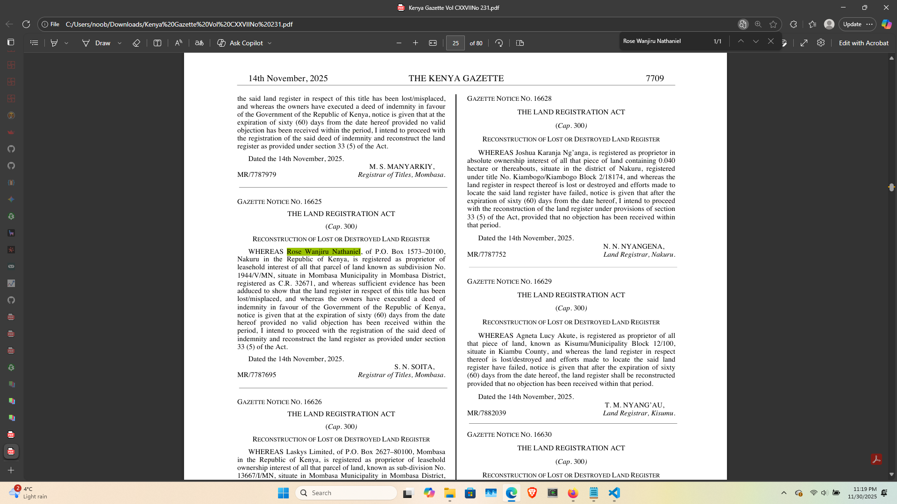

in other news : 11/30/2025 at 11.16'pm working draf1.py is working like a charm

prompt: From the Kenya Gazette Vol CXXVIINo 231.pdf summarize the important information about the The Land Act-Deletion, Corrigendum and Addendum,g

----for lama.py----
need to work on the following:

Entity extraction: refer to workingdraft1.py

general search should handle normal searches in the document

chatbotservice: 
it seems the document 
---
Summarize this document
03:40 PM
I'm sorry for the confusion, but I need more context to provide a relevant summary. Could you please specify which document or text you're referring to? Once I have that information, I'll do my best to condense and organize the key points into a concise summary.
03:40 PM

---

query seems to work but slow, and not related to the document:

[Unknown Document Relevance: 0.76] CNNs are a special type of neural network architecture introduced by Geoffrey Hinton et al., (1983). They are called "convolutional" because they operate using a specific set of features known as convolution layers, which are designed to detect certain visual patterns and operations such as edges or orientation. [Unknown Document Relevance: 0.76] A convolution layer in CNNs is made up of a stacked sequence of convolution layers, pooling layers, and fully connected layers (also called the hidden zones). The unique property of convolutional layers allows them to capture features that remain invariant under translation transformations - they are "translation-invariant." This property makes convolutional neural networks more effective at modeling spatial data like pixel images. [Unknown Document Relevance: 0.76] The convolution layer in a CNN can be understood as an artificial filter, composed of several learnable parameters that extract visual features from the input image. Each parameter corresponds to a specific feature map (or activation map), which captures one particular aspect of the original image. [Unknown Document Relevance: 0.76] The convolution operation in CNNs is called dot-product or linear layer, as described by Winograd's Neural Network Algorithm. It computes the pointwise product between corresponding elements from two matrices and adds them together to produce a single activation value. This process allows for efficient processing of image data using neural networks, since it only involves element-wise multiplication and summation operations rather than direct matrix multiplications that are computationally intensive. [Unknown Document Relevance: 0.76] In CNNs, the convolution layer is followed by a pooling layer, which reduces the spatial dimensions of the feature map (e.g., by taking the maximum value or average) while retaining important information. This downsampling step helps in reducing computational complexity and noise sensitivity during the forward propagation process. [Unknown Document Relevance: 0.76] The convolutional neural network architecture can be represented as follows: [Unknown Document Relevance 0.73 URL] In the context of a single CNN, this relevance is still available. It captures the essential features of convnets in indexed documents where the layers are represented by their indices (e.g., index "12" for convolutional layer, "14" for pooling layer). [Unknown Document Relevance 0.76] Inverted indexed convolutive neural networks are a type of convnet architecture that is particularly useful in image analysis and recognition tasks, like digit recognition or face detection. They have the ability to generate high-level features from pixel data using convolutional layers, pooling operations, and fully connected layers. These features can be used for more advanced classification models. [Unknown Document Relevance 0.76] Convolutional neural networks (CNNs) are highly effective in various tasks, including image recognition, video analysis, medical imaging, speech processing, and machine vision applications where spatial data is involved. The convolutional layer of a CNN plays a crucial role by extracting relevant visual features from pixelated images or videos. These features can then be used to classify the input using other neural network layers (e.g., fully connected networks). [Unknown Document Relevance 0.76] In convoluted neural networks, convolutional layers are responsible for detecting and learning the spatial patterns in image data by applying a set of filters to the original images. These filters capture specific features such as edges or orientation, allowing deeper CNN architectures like inverted indexed convolved neural networks to effectively extract high-level visual information from pixelized data. [Unknown Document Relevance 0.76] The convolutional layer in an optimized feedforward neural network is a powerful tool for extracting spatial features from the input images. The filters learned by this layer detect specific patterns, orientation or edge orientations that correspond to potential features in the image. These learned filters are then used to extract more complex and abstract visual information through subsequent layers of the model. [Unknown Document Relevance 0.76] Convoluted neural networks (CNNs) utilize a convolutional architecture for processing pixel-valued data, such as images. Their structure is composed of three main components: [Unknown Document Unknown Document Relevance 0.76 URL] There are multiple types of filters that can be used in an inverted indexed convolved neural network; each filter captures specific visual information like edge orientation or texture. [Unknown Document Relevance 0.76] In convolutional layers, the input volume is transformed into a set of learned filters through matrix multiplications and pointwise operations such as element-wise multiplication followed by addition. This feature extraction process allows the network to identify spatial features in images, making it particularly effective for tasks like image classification or object recognition where there are specific visual representations that can be identified. [Unknown Document Relevance 0.76] Inverted indexed convoluted neural networks have a unique architecture which utilizes convolutional layers in inverted indexing index patterns that allow efficient processing of pixel-valued data. These architectures enable the model to extract high-level features from input images, and can be applied for various image analysis tasks. [Unknown Document Relevance 0.76] A generalized CNN structure with convolved neural networks is: [Unknown Document URL
06:39 PM

python 3.13.5 env

pip install modelscope docling-tools rapidocr-onnxruntime opencv-python docling docling-core docling-parse llama-index-node-parser-docling 'markitdown[all]' nltk llama-index-llms-ollama llama-index-embeddings-huggingface "fastapi[standard]" PyMuPDF llama-index llama-index-core llama-index-vector-stores-chroma llama-index-retrievers-bm25 llama-index-embeddings-langchain llama-index-llms-openai

important run this to install local models> docling-tools models download-hf-repo ds4sd/SmolDocling-256M-preview

been running it with python lama.py

exlpore https://leapcell.io/  for hosting
$uvicorn lama:app --reload --port 8000

task:Find the GAZETTE NOTICE NO. 16787 and provide its contents and Summary

response by lamawithBM25.py

The document Notice 16787 is about the Judicial Service's Steering Committee's decision to develop and implement Court-Annexed Mediation for dispute resolution in Kenya. It further outlines the appointment of judges as part of this committee, based on indexed documents. The second document (page_29764) relevance is 3.58954 GAZETTE NOTICE 16786, which discusses the DPP's recommendation to close an inquiry into allegations against a Former Employee of Nairobi City Water and Sewerage Company (NCWSC). Summary: The Judicial Service Committee approved Court-Annexed Mediation as part of its Steering Committee, appointing judges for the Diplomatic Security Commission. Meanwhile, in Document 16787, it was confirmed that seven employees from Nairobi Water and Sewerage Company (NCWSC) did re-enter Kenya through the Department of Immigration's Namada border point after their official return on the DJ DPP Civil suit No. 354 of 2016. Please note that only the search results' query, indexed documents 81EACC/EL/INQ/7 (I)/2024 and Document_D16787, were used to find DJ inquiry's return date on 29th September 2025. The DPP returned the DJ File Civil Suit No. 354 of 2016 concurring with Commission recommendations to close file and notifies DPP that the DIN filed for closure is correct, confirming no objections were raised by official return dates reflected in documentation.
03:47 PM
